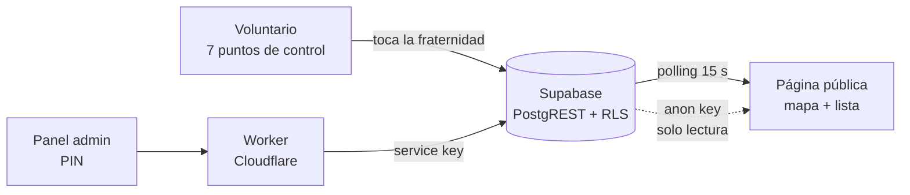

# Ch'utillos 2026 — Tracker del recorrido

Seguimiento en vivo de las fraternidades durante las entradas de la
Festividad de Ch'utillos, en Potosí. Del 28 al 30 de agosto de 2026.

Cliente: AFFAP (Asociación de Fraternidades Folklóricas y Autóctonas de
Potosí). Construido por Ainhoa Labs.

---

## Dónde está el código

**Ya no está en el árbol de trabajo.** Terminado el evento, `chutillos/`
y `supabase/` se sacaron del repositorio. Nada se perdió: el historial de
git los conserva enteros, y este documento es la guía para volver a
sacarlos de ahí.

La etiqueta `chutillos-2026` apunta al último commit que lo tiene todo
(`0e252a4`). Para recuperarlo:

```bash
git checkout chutillos-2026 -- chutillos supabase
```

Eso devuelve los 24 archivos al árbol de trabajo sin mover la rama. Para
solo mirarlo sin tocar nada: `git show chutillos-2026:chutillos/scripts/config.js`.

Todas las rutas que este documento menciona son relativas a ese árbol.

---

## Estado

**Terminado y cerrado.** El evento pasó. Primero el tracker salió de la
navegación del sitio y quedó como registro en `/chutillos/`, con `noindex`
y la insignia en "Finalizado"; después se retiró el módulo entero del
repositorio. Hoy `ainhoalabs.com` no tiene rastro de Ch'utillos: la ruta
`/chutillos/` ya no existe.

Lo que sí quedó en el repositorio es `worker/index.js`, que sirve el sitio
entero y no era solo de este proyecto.

Un dato que hay que decir sin adornos: **según lo que hay en el
repositorio, el sistema nunca llegó a operar con datos reales.**
`USAR_MOCK` quedó en `true`, `SUPABASE_URL` y `SUPABASE_ANON_KEY` están
vacías y el Worker nunca se desplegó desde acá. Todo lo que se vio durante
los tres días fue la simulación corriendo contra el reloj real. Si en
algún momento se conectó Supabase por fuera del repositorio, esto hay que
corregirlo — pero como está registrado, el recorrido, los puntos y el rol
son reales y el seguimiento no.

Lo que sí quedó terminado y probado: las cuatro pantallas, la geometría
del recorrido, el esquema de base con RLS, el Worker con PIN, la cola
offline y los datos oficiales del evento cargados.

---

## Qué resuelve

En las entradas de Ch'utillos desfilan 163 fraternidades a lo largo de
3.5 km, entre las 8 de la mañana y pasada la medianoche. La gente que va a
ver a la suya no sabe cuándo le toca: el rol publica una hora de ingreso,
pero el desfile se atrasa horas y nadie va actualizando nada.

El tracker responde una sola pregunta — **¿dónde va mi fraternidad ahora?**
— y la responde con lo único que se puede saber de verdad: por qué punto
de control pasó, cuándo, y cuánto pudo avanzar desde entonces.

---

## Cómo funciona

Siete voluntarios, uno por punto de control, con un enlace personal en el
celular. Cuando pasa una fraternidad, la tocan en una lista. Eso es todo
lo que entra al sistema.



Con esos reportes sueltos, la página pública reconstruye el desfile
entero. Ahí está casi todo el trabajo:

**Una banda, no un punto.** Sabemos que la fraternidad pasó por el Punto 3
hace 20 minutos. No sabemos dónde está *exactamente*. Dibujar un punto
sería afirmar una precisión que no tenemos, así que se dibuja una banda
sobre el trazado: desde donde estaría al ritmo más lento hasta donde
estaría al más rápido. La banda es ancha cuando el dato es viejo y
angosta cuando es reciente. La incertidumbre se ve.

**El desfile es una fila, no puntos sueltos.** Ninguna fraternidad puede
meterse dentro de otra. Se calculan en orden de ingreso, encadenadas
cabeza con cola: 110 m de cuerpo y entre 20 y 130 m de hueco. Si la
estimación de una la pondría encima de la de adelante, se la frena. Es lo
que hace que el mapa se lea como un desfile y no como un enjambre.

**La frescura se mide contra el tramo, no contra un reloj fijo.** El tramo
Punto 3 → Punto 4 son 792 m: casi una hora sin noticias, y es normal. El
más corto son 33 minutos. Un umbral fijo pintaría de gris el tramo largo
aunque todo estuviera funcionando. Se compara el tiempo transcurrido con
el tiempo esperado *de ese tramo*.

**La ficha dice la calle, no el punto de control.** "Va por la Avenida
Tinkuy" ubica a cualquiera. "Entre el Punto 3 y el Punto 4" no significa
nada para quien está en la calle — un punto de control es una referencia
nuestra, una avenida es de la ciudad.

---

## Las cuatro pantallas

| Ruta | Quién | Qué hace |
|---|---|---|
| `/chutillos/` | público | Mapa, lista, buscador. Sin login. |
| `/chutillos/checkpoint/?t=…` | 7 voluntarios | Lista del día; se toca la fraternidad al pasar. |
| `/chutillos/admin/` | AFFAP | PIN. Padrón, enlaces, estado. |
| `/chutillos/admin/recorrido/` | interno | Editor de trazado, puntos y calles sobre el mapa. |
| `/chutillos/portador/?t=…` | — | GPS a bordo. **Sin uso en 2026**, código conservado. |

El editor de recorrido no estaba previsto. Salió de un problema real: para
dibujar el trazado hacía falta saber por dónde pasa el desfile, y eso no
se deduce de un mapa. En vez de inventar coordenadas, se construyó la
herramienta para que el cliente las marcara. Lo mismo con los 7 puntos y
con los nombres de las calles. Los tres conjuntos de datos salieron de ahí.

---

## Los datos del evento

Todos reales, todos cargados.

**Recorrido** — 18 puntos, 3518 m. Del Arco Mejillones a la Plaza San
Bernardo.

**7 puntos de control**, marcados sobre el trazado (desvío 0 m):

| Punto | Metros | Tramo previo | A 0.80 km/h |
|---|---|---|---|
| 1 | 43 | — | confirma la salida |
| 2 | 503 | 460 m | ~35 min |
| 3 | 949 | 446 m | ~33 min |
| 4 | 1741 | 792 m | **~59 min** |
| 5 | 2306 | 565 m | ~42 min |
| 6 | 2788 | 482 m | ~36 min |
| 7 | 3448 | 661 m | ~50 min |
| — | 3518 | 70 m | ~5 min |

**9 calles y avenidas**, sin huecos ni superposiciones: Arco Mejillones,
Calle Mejillones, Calle H. Vásquez, Avenida Tinkuy, Avenida Universitaria
(62 m, apenas un cruce), Avenida Sevilla, Avenida Litoral, Avenida Cívica,
Plaza San Bernardo. Siete de los ocho cortes caen sobre giros reales del
trazado.

**Rol de Ingreso oficial de la AFFAP**, 163 ingresos:

| Día | Jornada | Ingresos | Horario |
|---|---|---|---|
| Vie 28 | Danzas Autóctonas | 60 (6 grupos) | 08:30 – 19:25 |
| Sáb 29 | Danzas Folklóricas | 56 (5 grupos) | 08:00 – 19:00 |
| Dom 30 | Entrada Autóctona | 47 (sin grupos) | 10:00 – 17:40 |

Los afiches del 28 y 29 numeran del 1 al 10 (o al 12) **dentro de cada
grupo**, así que ese número no identifica a nadie. `orden_ingreso` es
global — el orden que se ve en la calle — y el grupo del afiche se guarda
aparte para poder cotejar con el impreso.

El día 30 tiene un campo propio, `entidad`: hay tres "Sicuriada", tres
"Jula Jula" y tres "Carnaval Blanco", y lo único que las separa es el
municipio o la comunidad. Sin ese campo el buscador es inútil y el
voluntario no puede saber cuál acaba de pasar.

### Transcripción

Los 163 nombres se transcribieron a mano de los afiches. Las lecturas
dudosas están anotadas en `DUDAS_DE_TRANSCRIPCION`, dentro de
`chutillos/scripts/mock-data.js`. **Siguen sin verificar contra el
impreso.** Las que más importan:

- El afiche del 28 salta el N° 7 del Grupo 1 y también la franja de las
  10:00. Se respetó tal cual en lugar de renumerar.
- Día 28, Grupo 5 N° 10: la hora no se lee en el afiche. Cargada 17:00 por
  la cadencia del grupo. **Es el único dato inventado del padrón.**
- El afiche del 29 escribe "Llamarada"; la danza suele escribirse
  "Llamerada". Se respetó el afiche.
- Ambiguas: Kachamosos/Kachanosos, Maypes/Maypas, Yotalerios/Yotaleños,
  Antaveras/Antawaras.

---

## Números que gobiernan el mapa

Están todos en `chutillos/scripts/config.js`.

| Constante | Valor | De dónde sale |
|---|---|---|
| `VELOCIDAD_KMH` | 0.80 | Salidas 08:00–19:25 y última llegada entre 23:00 y la madrugada. **El número más importante.** |
| `VELOCIDAD_MIN/MAX_KMH` | 0.55 / 1.30 | Ancho de la banda de incertidumbre. |
| `LARGO_CUERPO_M` | 110 | Largo de una fraternidad. |
| `ESPACIO_MIN/MAX_M` | 20 / 130 | Hueco entre una y la siguiente. |
| `POLL_MS` / `POLL_MS_OCULTO` | 15 s / 60 s | Ritmo de lectura, más lento con la pestaña oculta. |

La velocidad se calibra mirando `reportes_checkpoint`: cuánto tardó una
fraternidad entre dos puntos, dividido por la distancia del tramo. Si el
mapa se ve adelantado respecto de la calle, está alta; si las bandas se
quedan pegadas al punto anterior, está baja.

En la simulación hay además `ATRASO_ARRANQUE_MIN` (40 min), que es el
atraso real con que arrancó el rol el domingo 30.

---

## Decisiones y por qué

**Polling en vez de websockets.** Miles de personas mirando a la vez. Una
conexión abierta por visitante es justo lo que rompe el día del evento, y
el plan gratuito de Supabase tiene tope de conexiones concurrentes. Con
polling, una petición perdida se recupera sola en el ciclo siguiente.

**Cola offline en el celular del voluntario.** La señal en el recorrido no
es confiable y el reporte no se puede perder. Cada toque se guarda en
`localStorage` y se reintenta con espera creciente; los duplicados se
descartan por `client_id`. Los errores permanentes (token inválido) se
distinguen de los transitorios: los primeros se descartan, los segundos se
reintentan.

**Sin portadores GPS.** Se evaluó llevar un celular transmitiendo dentro
de cada fraternidad. Se descartó por batería y por logística. La
consecuencia es que **no hay respaldo si un voluntario falla**: las
fraternidades que pasen por ese punto quedan sin actualizar hasta el
siguiente, hasta 59 minutos en el tramo largo. Por eso el plan de dotación
incluía relevos flotantes. El código del portador quedó completo y
probado — se enciende con `GPS_HABILITADO: true`.

**Escrituras de admin por Worker, nunca desde el navegador.** La anon key
de Supabase es pública por diseño. Un PIN validado en el cliente no es una
restricción de acceso, es una sugerencia. El PIN se verifica en el
servidor, con comparación de tiempo constante y sesiones firmadas con
HMAC; la `service_role` key nunca sale de Cloudflare. Las políticas RLS
bloquean toda escritura directa con la anon key, y los tokens no son
legibles: el `GRANT` de `SELECT` excluye esas columnas.

**El HTML no se cachea; los assets versionados sí.** Las páginas piden sus
scripts como `publico.js?v=27`. Ese esquema solo funciona si el HTML que
trae el número llega fresco — con un HTML cacheado el navegador sigue
pidiendo la versión vieja y no ve ningún cambio por más que se publique.
Cuesta horas de diagnóstico si no está previsto.

**No publicar una hora sin confirmar.** Mientras el rol cargado fue el de
la Pre-Entrada, `ROL_OFICIAL` estuvo en `false` y la página no mostró
horarios. La gente organiza su día con esa hora: una equivocada es peor
que ninguna.

---

## Estructura

Así quedó el módulo (recuperable con `git checkout chutillos-2026 -- …`):

```
chutillos/
  index.html            página pública
  checkpoint/           voluntario de punto de control
  portador/             GPS a bordo (sin uso en 2026)
  admin/                panel con PIN
  admin/recorrido/      editor de trazado, puntos y calles
  scripts/
    config.js           TODAS las constantes y banderas
    mock-data.js        datos del evento + simulación
    data.js             capa de datos: mock o PostgREST
    recorrido.js        geometría pura del trazado
    util.js             estimación, frescura, normalización
    queue.js            cola offline con reintentos
    publico.js  checkpoint.js  portador.js  admin.js
  styles/chutillos.css
worker/index.js         estáticos + /api/admin con PIN  ← SIGUE EN EL REPO
supabase/
  README.md             puesta en producción, paso a paso
  schema.sql            6 tablas, RLS, RPC SECURITY DEFINER
  seed-*.sql            recorrido, checkpoints, calles, fraternidades
```

Unas 6.400 líneas en 25 archivos. HTML, CSS y JavaScript sin framework ni
paso de build: se sirve tal cual desde Cloudflare Workers. Las únicas
dependencias externas son Leaflet (unpkg, con `integrity`) y las tipografías
de Google Fonts — JetBrains Mono e Inter, las mismas del sitio.

`seed-fraternidades.sql` se **genera** desde `mock-data.js`, que es la
fuente. Si el rol cambia se corrige ahí y se vuelve a generar —
transcribir dos veces lo mismo es como se meten las diferencias entre el
sitio y la base. Es un *upsert* por `id`: un `DELETE` arrastra en cascada
los reportes ya cargados, y corregir un nombre en pleno evento no puede
costar el seguimiento del día.

---

## Volver a levantarlo el año que viene

1. Recuperar el código: `git checkout chutillos-2026 -- chutillos supabase`.
2. `EVENTO_TERMINADO: false` y `ROL_OFICIAL: false` en `config.js`.
3. Cargar el rol nuevo en `mock-data.js` y regenerar
   `seed-fraternidades.sql`.
4. Confirmar recorrido y puntos de control con la AFFAP — si cambian, se
   vuelven a marcar en `/chutillos/admin/recorrido/`.
5. Crear el proyecto de Supabase y seguir `supabase/README.md`:
   esquema, seeds, tokens, secretos del Worker.
6. `USAR_MOCK: false` con las credenciales cargadas.
7. `ROL_OFICIAL: true` recién con el rol definitivo.
8. Volver a enlazar `chutillos/` desde la navegación en `index.html` y
   quitarle el `noindex`.
9. Repartir los enlaces de voluntario desde el panel admin, pestaña
   Enlaces. **Uno por persona, nunca en grupos abiertos** — quien tiene el
   enlace puede reportar en nombre de ese punto.

Las comprobaciones previas al evento están en `supabase/README.md`, § 6.

---

## Pendientes

- **Conectar Supabase.** Es lo único que separa esto de funcionar de
  verdad. Nunca se hizo.
- **Desplegar.** `wrangler` no tiene sesión iniciada en este equipo y
  `ainhoalabs.com` no resuelve: no tiene registros DNS.
- **Cotejar los 163 nombres** contra los afiches impresos.
- **Calibrar `VELOCIDAD_KMH`** con datos reales. Sin una jornada
  registrada en `reportes_checkpoint`, sigue siendo una estimación.
- Verificar en el mapa el tramo de 62 m de la Avenida Universitaria.
- Considerar correr el Punto 3 unos 230 m adelante, para partir el tramo
  de 59 minutos.
- `worker/index.js` se dejó intacto por decisión del cliente: sigue
  sirviendo el sitio y manteniendo las cabeceras de caché, pero conserva
  `/api/admin` y el bloqueo de `/supabase/` apuntando a cosas que ya no
  están en el árbol. Es código muerto, inofensivo, y hace falta el día
  que se recupere el módulo.
